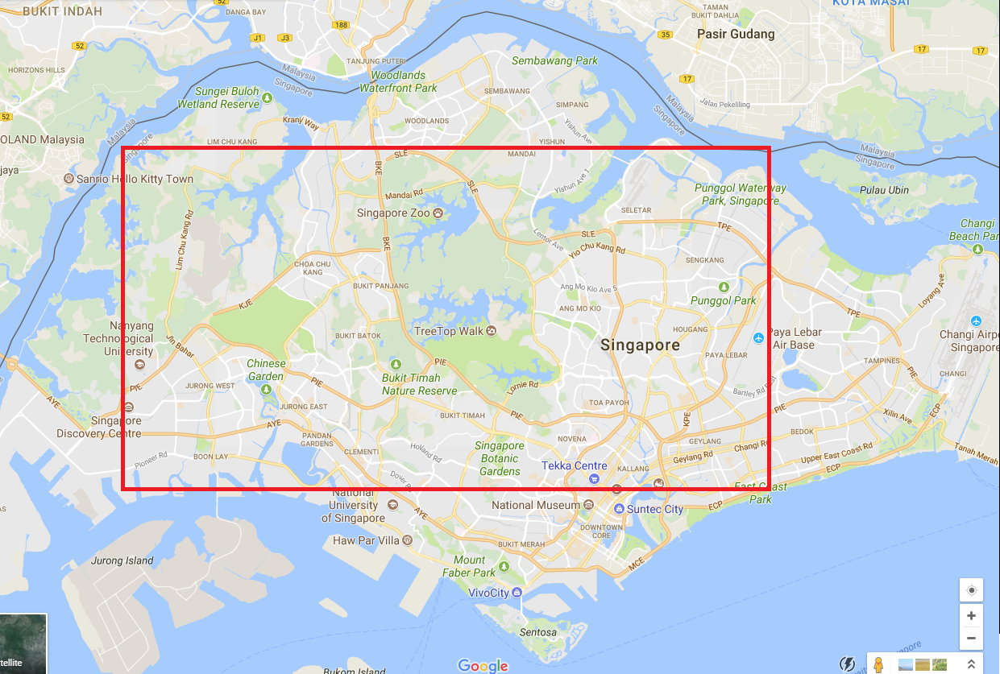

# HDB-Simulation

This project aims to simulate the Housing Development Board's allocations of Singapore. Though it is worth to mention that many research papers have pointed out the briliance of this model in comparison with others around the world, from social welfare, real estate and housings' perspective, no official documentation explains explicitly the underlying mechanism and its correctness. With this in mind, we target to answer 2 primary questions:
* Is there any gap between the current solution and the actual optimal allocation, with and without ethnicity constraint?
* Can we propose a better approach?

## Introduction

In 1960, the housing crisis in Singapore leads to the creation of Housing Development Board. Thousands of houses are rapidly built to fulfill the over-demanding issue at that time. Up to now, several mechanisms are applied to distribute house units among Citizens and Permanant Residents who are looking for a place to settle down and having stable life. First come first serve basis and selling for buyers who are willing to pay most happen for a few years. Apprently the second one do harm to low-level class, who have little or no asset to compete against the others. The first one, on the other hand, facing the issue that people keep applying for each project, though the long queue increasing day by day, the true proportion of people actually buy houses is minority. These observations are awared by the government, and the fact that housing matter mingles with social security in this Merlion country motivates Singapore to look for alternative way to overcome one of the biggest challenges in its short history of formation and development.

Since then, efforts are made to rebuild a system that gives fair chances for everybody, no matter how much their incomes are, and penalises anyone abuses their privilege to slow down the proceeding as well as affect other buyers. Regretly to say, thought its widely-known reputation in the literature, we could not find any explicit document that describe utterly the whole underlying model. Despite that fact, no one seems to be intrigued, as long as people living peacefully in harmony. Speaking of which, racial harmony is the third achievement of current system, which prohibits any ethnicity from forming their own group in any particular area. The limitation of quota in each group is a bit higher than actual proportion in the population, both allows flexibility, and sets an upperbound for any group intend to expand their population. 

We do not claim any correctness in following document, but this guaranteely gives a big picture of the current system. See it [here](HDB_Mechanism.pptx). 

## Utility model

One step at a time, our first attemp is simplifying the whole model into its simplest form, which consists of $N$ agents (buyers) and $M$ flats (apartments). Given utility $u_{i, j}$ of agent $i$ for each flat, playing the role of God, we will assign each pair in such a way that total utility of final allocation is maximum. This optimized problem could be simply addressed by formulating into Linear Programming form, once one acknowledges the preference of agents.

Unfortunately, it surely takes months and costly effort to collect actual preference of buyer, let alone noises and errors due to human's limitation. However, thanks to openly public dataset of Singapore government, we can connect reasonably a subset of information to create an acceptable utility model. By saying a subset, in fact each information can stand alone to make an appropriate estimation of actual preferences. Nevertheless, we start with 3 simple pieces of information:

1. Trend-based: People tend to buy houses in favour of current trend. In other words, a highly estimated valuable house is prefered by a great proportion of population, would stay at the top of the list of buyers.

2. Flat type: Each type of family has a certain flat-type in mind. A 4-people family definitely have no interest in single-room flat, for instance.

3. Location-based: Needless to say, living near parents, your work office, or good public school, are the most concerned factors when speaking of choosing houses. Given a point of interest of each agents, the desire for the flat inversely proportional to its distance to that particular point. We can proceed further to floor level as well as how many views one can have, but this could be left for now.

### Trend-based model

Simplicity provides a good start and direction for where the project is heading to. Applying the same philosophy, this utility is no other than verification of the implementation, an Input/Output testing from the point of view of Software Engineering. Another point is notably worth to say, this model is the easiest to reduce the Computational Complexity, from the perspective of Mechanism Design.

A sale launch consists of several blocks, hence our assumption is people values according to blocks, with a small variant in its contained flats. The generated preference - utility must be non-negative, and Beta Distribution is the best suite of this kind, which can produce sample in a particular range.

~~~
1. Each block is differed in terms of parameter of Beta Distribution, yet flats within it sharing the same distribution. 
2. For each agent_i:
       Draw the utility of her for each flats from predefined distribution
       Normalize utility such that they are non-negative and sum is equal to 1
~~~

### Flat type model

For now, we considered this as a supported attribute rather than a representative model. It would be incorporated in later version of this experiments. An observation were made when collecting data is, for some blocks, they only consists of a certain flat type.

### Location-based model

A more realistic model is location-based, whereas each people have one personal point of interest that indicate the nearer the housing block, the higher in utility value. The actual locations of block is collected manually on Google Map with provided information from HDB website, in a period of time or one sale launch. Furthermore, we limit the points of interest generated within below red rectangular area, without taking into account of density of population yet, though it's good estimator in future.

  
    
  <b>Designated area to generate uniformly points of interest for every agent.</b> 

~~~
1. Indicate the coordinate(longitude and latitude) of each block.
2. Generate points of interest for each agents uniformly in designated area.
3. For each agent_i:
       Calculate the distance to each blocks
       The utility is 1 over the distance (inversly proportional)
       Normalize utility such that they are non-negative and sum is equal to 1
~~~

We do not stop it there! By mixing the location with ethnicity factor, an additional twist is added to reflect the fact that people in a same community tend to gather in one focus point.

~~~
1. Indicate the coordinate(longitude and latitude) of each block.
2. Generate 1 point of interest for each ethnicity uniformly in designated area.
3. For each agent_i:
       Calculate the distance to each blocks from its ethnicity's point
       The mean is 1 over the distance (inversly proportional)
       Determine the variance with a small fixed value or according to mean.
       Draw one sample from the newly formed BETA DISTRIBUTION
       Normalize utility such that they are non-negative and sum is equal to 1
~~~

Note that we need to normalize the mean in such a way that satisfied following constraints:

$$0 < \mu_{Beta} < 1$$

$$0 < \sigma^2_{Beta} < \mu_{Beta}*(1-\mu_{Beta})$$
## Solver model

With respect to obtained utility, we use 2 proposed solver to calculate optimal solution, within and without ethnicity constraint. 

### Integer Programming Solver

Newly generated utility would be simply put into this problem formulation to solve:

$$max \sum_{j \in M} \sum_{i \in N} u_{ij}x_{ij}$$

such that

$$\sum_{i \in N} x_{ij} \leq 1, \forall i$$
$$\sum_{j \in M} x_{ij} \leq 1, \forall j$$
$$x_{ij} \in \{0; 1\}$$

With ethnicity taken into account, one additional line of constraint is set with $E$ is ethnicity, $B$ is block:

$$max \sum_{j \in M} \sum_{i \in N} u_{ij}x_{ij}$$

such that

$$\sum_{i \in N} x_{ij} \leq 1, \forall i$$
$$\sum_{j \in M} x_{ij} \leq 1, \forall j$$
$$\sum_{i \in E} \sum_{j \in B} x_{ij} \leq C_{EB}, \forall E \forall B$$
$$x_{ij} \in \{0; 1\}$$

### Lottery Solver

~~~
1. While there is unallocated flat and not all agents are marked:
2.     Randomly picking one unmarked agent.
3.     For all unallocated flat, give her the one she favours most.
       If taking into account ethnicity contraint, only provide the flats within block does not violate 
       the quota of her ethnicity (this could lead to zero flat remains)
4.     Mark the agent (no matter she is allocated or not) and block.
~~~

## Environment

* Programming Language: ``Python 3``
* Linear Programming Solver: ``GLPK`` with wrapper is ``PuLP`` package for Python.
* Required package: ``numpy``, ``abc``, ``math``, ``matplotlib``, ``random``.

## Developer Guide

* [solver.py](../source/solver.py): open for extension. One can run direcly the test suite after each updating.
* [utility.py](../source/utility.py): open for extension. One can run direcly the test suite after each updating.
* [main.py](../source/main.py): running comparation between 2 utilities (random and location) and 2 mechanisms (integer programming and lottery solver).

## Result

Update later.
- [ ] For approximately 3000 agents and 1500 flats, it took more than 12 hours to finish up the writing input, and I think this is the current bottleneck in the implementation, or API of PuLP, to be precise.
- [ ] Current implementation is for pair-wise, try to compare 4 settings at the same time, within 1 utility model.
- [ ] Change variance smaller corresponding to mean of beta distribution. Instead divide $\sigma^2 = \frac{\mu * (1-\mu)}{2}$ with a factor 2, try 10. 
- [ ] To scale up to actual data, my approach is normalize actual dataset into 10 units for each block or project. 